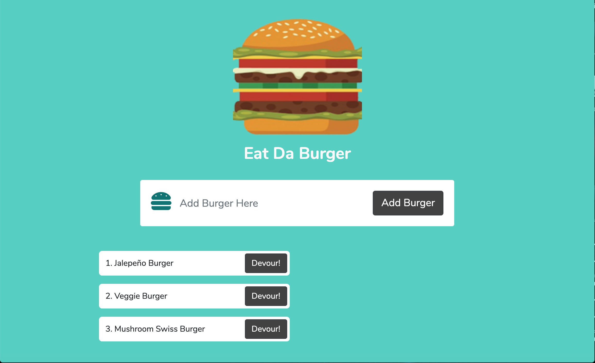

# Eat Da Burger

  ## Table of Content
  -[Description](#description)
  -[Technologies](#technologies)
  -[Usage](#usage)
  -[DEMO](#demo)

## Description
The following application is a restaurant app that lets users input the names of burgers they'd like to eat. Once a user submits a burger's name, the app will display the burger on the left side of the page -- waiting to be devoured. When the user clicks the devour button, the burger will move to the right side of the page indicating that it has been devoured.

## Technologies
This application uses the following: Node.js, require, express, express-handlebars, mySQL, and module exports.

## Usage
Deployed using Heroku

## Demo

